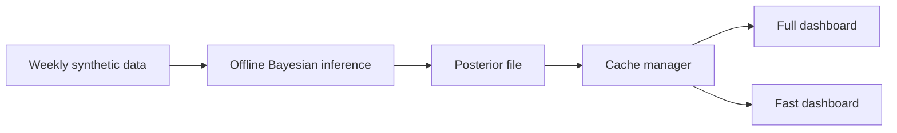
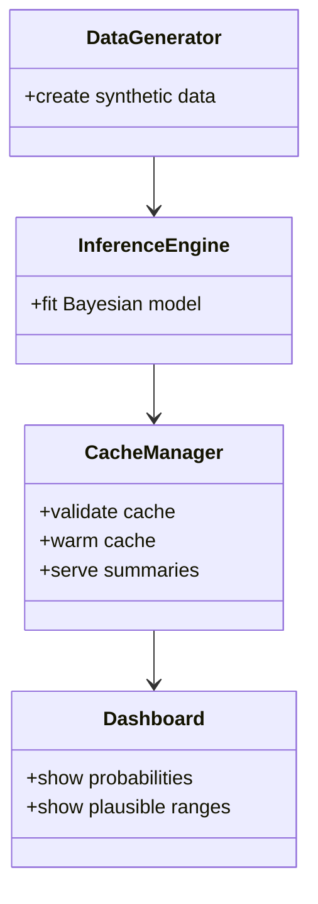

# Lay-Person Guide: What This Project Does and Why It Matters

## Audience
Non-technical readers, stakeholders, and new collaborators.

## Purpose
Explain this project in plain, friendly language so you can understand it quickly and ask good questions.

## First things first

You can think of this project as an early-warning conversation tool.

It does not tell hospitals what to do.
It does not make clinical decisions.
It does help teams talk about uncertainty in a clearer way.

## The simple story

Imagine you are trying to judge pressure in a busy system.
You have useful clues, but not perfect certainty.
This project combines clues and tells you how likely different pressure levels are.

That is why it uses probability.
Not because probability is fancy, but because confidence can be misleading when data are noisy.

## What you see in the app

1. A selected area.
2. A pressure index shown as a distribution, not a single number.
3. Plausible ranges showing what is more or less likely.
4. Reference lines for discussion.

Important: those reference lines are not official thresholds in this prototype.

## Visual map

How to read this:

1. Data are generated for safe demonstration.
2. Model fitting happens offline.
3. Results are cached.
4. Dashboards read cached results quickly.

## A friendly analogy

Think of weather forecasting.

A weather app might say there is a 70 percent chance of rain.
You still choose whether to carry an umbrella.
The model informs your judgement; it does not replace it.

This project works in a similar way for system pressure conversation.

## Who does what

## What this project does not do

1. It does not use real patient records in this prototype flow.
2. It does not provide diagnosis or treatment advice.
3. It does not set policy thresholds.
4. It does not remove the need for human judgement.

## Why this can still be useful

1. It helps teams discuss uncertainty honestly.
2. It makes hidden assumptions visible.
3. It supports safer design conversations before any operational rollout.

## If you are new, start here

1. Read this guide once through.
2. Read the glossary for key terms.
3. Read the technical summary if you want deeper detail.
4. Use the runbook if you want to run the code.

## Related links

1. docs home: ../README.md
2. glossary: ../70-reference/glossary.md
3. runbook: ../40-operations/RUNBOOK.md
4. technical summary: ../30-model/TECHNICAL_SUMMARY_ADVANCED.md
5. governance overview: ../50-governance/GOVERNANCE_OVERVIEW.md
