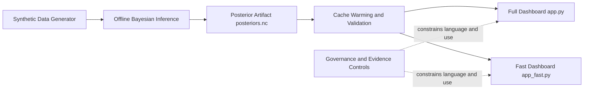

# Architecture and Rationale

## Audience

Engineers, statisticians, governance reviewers, delivery leads, and operators.

## Purpose

Provide a defensible, project-wide architecture baseline that links design choices to evidence, operational constraints, and governance expectations.

## Scope

In scope:

1. end-to-end system structure;
2. component boundaries and data contracts;
3. architectural rationale and trade-offs;
4. assurance and evidence pathways.

Out of scope:

1. production NHS deployment approval;
2. clinical policy authoring;
3. real patient-data integrations.

## Why this architecture matters

This project is intentionally structured as an evidence-to-decision support system.
It prioritises uncertainty-aware communication, reproducibility, and safe interpretation over raw throughput or predictive bravado.

The architecture is designed to answer one core question defensibly:

How can probabilistic pressure signals be generated and communicated in a way that is technically transparent, operationally reliable, and governance-safe?

## System context

## Architectural principles

1. Uncertainty-first outputs: present probabilities and intervals, not deterministic point claims.
2. Offline-online separation: keep MCMC and heavy computation away from user interaction paths.
3. Reproducible artifacts: persist posterior outputs and derived summaries for replay and audit.
4. Explicit non-scope controls: make prototype boundaries and non-clinical status unmissable.
5. Audience-specific communication: preserve one evidence base while adapting explanation depth.

## Component boundaries and responsibilities

1. Synthetic data generation layer
Role: produce safe, controlled NHS-style demonstration data.
Rationale: enables collaboration and governance review without patient-identifiable risk.

2. Bayesian inference layer
Role: fit latent-pressure model and produce posterior artifacts.
Rationale: probabilistic outputs better represent epistemic uncertainty in noisy system indicators.

3. Cache and artifact contract layer
Role: transform posterior artifacts into fast-load summaries and sample arrays.
Rationale: converts compute-heavy outputs into stable serving contracts.

4. UI serving layer
Role: deliver full and fast dashboards from cache only.
Rationale: protects latency and reliability; avoids hidden runtime fitting behaviour.
Operational reliability note: dashboard launch uses automatic port fallback to avoid startup failure when default local ports are occupied.

5. Governance control layer
Role: enforce interpretation boundaries through language, assumptions, and references.
Rationale: reduce risk of prototype outputs being mistaken for policy triggers.

## Evidence and assurance map

1. Purpose and scope boundary: [../../README.md](../../README.md)
2. Model structure and uncertainty semantics: [../30-model/TECHNICAL_SUMMARY_ADVANCED.md](../30-model/TECHNICAL_SUMMARY_ADVANCED.md)
3. Cache reliability contract: [cache/CACHE_LAYER.md](cache/CACHE_LAYER.md)
4. Operational controls and run flow: [../40-operations/RUNBOOK.md](../40-operations/RUNBOOK.md)
5. Governance posture and mitigations: [../50-governance/GOVERNANCE_OVERVIEW.md](../50-governance/GOVERNANCE_OVERVIEW.md)
6. Assumption tracking and validation expectations: [../70-reference/assumptions-register.md](../70-reference/assumptions-register.md)
7. External standards and references: [../70-reference/references.md](../70-reference/references.md)

## Key trade-offs

1. Fast and reproducible serving versus real-time model adaptation.
2. Communication clarity versus methodological complexity in user-facing interfaces.
3. Prototype velocity versus depth of statistical assurance in fast cycles.

## Architecture risks and controls

1. Risk: reference lines interpreted as operational thresholds.
Control: mandatory caveats, glossary-locked terminology, governance review.

2. Risk: prototype interpreted as production-ready forecasting service.
Control: explicit non-scope statements in top-level and audience docs.

3. Risk: reduced inference assurance in fast mode.
Control: periodic full diagnostics and documented assumptions around fast-path use.

## Canonical deep dives

1. OOP architecture support: [oop/README.md](oop/README.md)
2. Cache architecture support: [cache/README.md](cache/README.md)
3. Legacy redirect page: [../TECHNICAL_OVERVIEW.md](../TECHNICAL_OVERVIEW.md)

## Owner

Engineering and modelling leads.

## Last updated

2026-05-26
