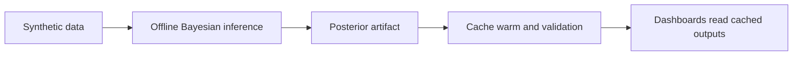

# Technical Summary (Simplified)

## Audience

Engineers, analysts, technical leads, and governance reviewers.

## Purpose

Explain how the system works, why it is designed this way, and what claims are and are not justified.

## Scope

In scope:

1. architecture and data flow;
2. model meaning and uncertainty;
3. strengths, limits, and safe use.

Out of scope:

1. production-readiness claim;
2. clinical-effectiveness claim;
3. policy-threshold validation.

## One-minute summary

This project estimates a pressure index using Bayesian inference on synthetic NHS-style data.
Model fitting happens offline, and dashboards read cached results.

Why this matters:

1. user-facing performance is stable;
2. outputs are reproducible and auditable;
3. uncertainty is shown explicitly.

## 1. How the system works

Design choice: separate heavy inference from UI serving.

Benefits:

1. faster dashboard experience;
2. fewer runtime surprises;
3. easier review of saved artifacts.

## 2. What the model output means

The model returns probability distributions, not certain truths.

A useful expression is:

$P(z_i > c \mid D)$

This means: probability that area $i$ is above a reference level $c$, given data $D$.

Important: this is evidence for discussion, not an automatic decision rule.

## 3. Strengths and limits

### Strengths

1. clear uncertainty representation;
2. robust offline/online split;
3. cache-first serving model;
4. safe synthetic-data setup.

### Limits

1. synthetic generator and fitted model are not perfectly matched;
2. fast mode has lighter diagnostics;
3. reference lines are not calibrated policy thresholds.

## 4. Safe interpretation boundaries

This work supports:

1. uncertainty-aware planning conversations;
2. technical model review;
3. prototype communication and learning.

This work does not support:

1. clinical decision automation;
2. direct policy triggering;
3. claims of validated operational forecasting.

## 5. What to read next

1. architecture rationale: [../20-architecture/README.md](../20-architecture/README.md)
2. governance controls: [../50-governance/GOVERNANCE_OVERVIEW.md](../50-governance/GOVERNANCE_OVERVIEW.md)
3. assumptions register: [../70-reference/assumptions-register.md](../70-reference/assumptions-register.md)
4. evidence references: [../70-reference/references.md](../70-reference/references.md)
5. operations runbook: [../40-operations/RUNBOOK.md](../40-operations/RUNBOOK.md)

## Assurance statement

This summary supports a prototype-level claim only.
It is suitable for communication and technical exploration under synthetic-data constraints.

Production or clinical claims require additional validation, calibration, and formal governance sign-off.

## Last updated

2026-05-26
