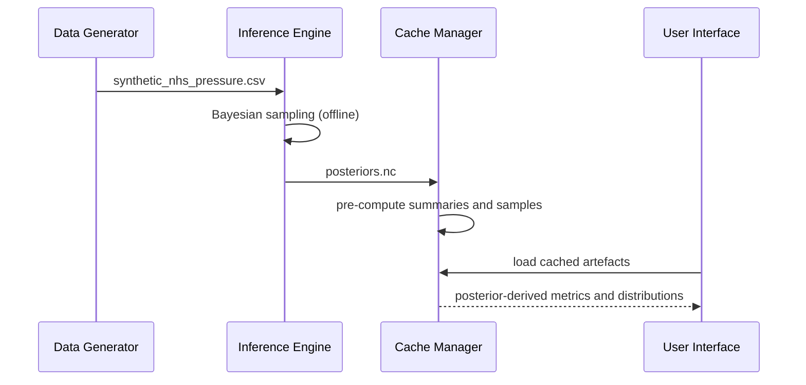
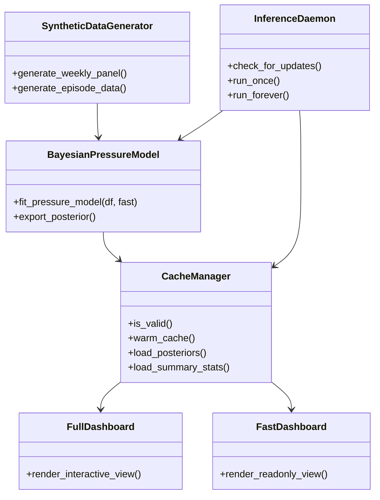

# Advanced Technical Summary

## Audience
Engineers, statisticians, technical leads, and governance reviewers seeking deep methodological context.

## Purpose
Provide a high-rigour explanation of the system architecture, modelling assumptions, uncertainty semantics, strategic posture, and launch communication implications.

## Executive summary

This project implements a Bayesian latent-pressure workflow over synthetic NHS-style panel data, with a strict separation between offline inference and online serving.

Its principal strengths are transparency, modularity, and communication-oriented uncertainty framing.
Its principal weaknesses are model-generator structural mismatch, limited diagnostic depth in fast mode, and potential threshold misinterpretation by non-technical audiences.

## 1. System architecture and information flow

### 1.1 Pipeline

### 1.2 Architectural rationale

The offline-online split addresses three constraints simultaneously:

1. computational heaviness of MCMC;
2. user-facing latency expectations;
3. reproducibility and auditability of model outputs.

This architecture is consistent with a bounded-context design where statistical computation and interaction presentation are intentionally decoupled.

## 2. Statistical framing

### 2.1 Core latent structure

At a conceptual level, the model expresses a latent pressure index as:

$z_i = \mu + \sigma_{icb} \cdot \alpha_i$

where:

1. $\mu$ is the shared baseline latent component;
2. $\alpha_i$ is an area-specific effect;
3. $\sigma_{icb}$ scales between-area heterogeneity.

Observed bed occupancy is then modelled via a Gaussian observation model with linear link to latent pressure.

### 2.2 Epistemic interpretation

Posterior outputs encode updated belief distributions, not deterministic states of reality.
This supports probabilistic statements of the form:

$P(z_i > c \mid D)$

for communication reference value $c$ and observed data $D$.

### 2.3 Identifiability and hierarchy caveat

When fitting a single-area slice, hierarchical separation weakens conceptually, reducing the practical meaning of national-versus-local decomposition. This is a communication risk if labels are interpreted causally or organisationally.

## 3. Methodological strengths and limitations

### 3.1 Strengths

1. Explicit uncertainty representation.
2. Structured separation of computation and serving.
3. Practical cache-first operational design.
4. Transparent synthetic-data framing.

### 3.2 Limitations

1. Structural mismatch between synthetic generator dynamics and fitted model assumptions.
2. Limited exploitation of multivariate indicators.
3. Fast-mode inference settings reduce assurance depth.
4. Reference thresholds are not externally calibrated.

## 4. SWOT analysis

### 4.1 Project SWOT

| Dimension | Analysis |
|---|---|
| Strengths | Clear modular architecture, uncertainty-first communication, reproducible offline artefacts, synthetic-data safety. |
| Weaknesses | Potentially ambiguous threshold semantics, limited diagnostic regimen in fast mode, partial hierarchy fragility in narrow slices. |
| Opportunities | Extend to richer temporal and multivariate models, establish calibration framework, build governance-ready evaluation pack. |
| Threats | Misinterpretation as policy tool, over-claiming readiness, communication drift across technical and non-technical channels. |

### 4.2 Communication SWOT

| Dimension | Analysis |
|---|---|
| Strengths | Existing governance tone is explicit and responsible; vocabulary can be standardised through glossary-first policy. |
| Weaknesses | Legacy docs overlap can obscure canonical messages. |
| Opportunities | Audience-specific pathways and hyperlinked taxonomy can reduce onboarding friction and improve review quality. |
| Threats | Divergent paraphrasing in PRs can reintroduce ambiguity and overstatement. |

## 5. Launch posture and communication strategy

### 5.1 Suggested launch phases

1. Internal technical preview: engineering and modelling audience.
2. Controlled stakeholder walkthrough: operational and governance audience.
3. Broader prototype communication: only with explicit scope boundary statements.

### 5.2 Minimum launch communication pack

1. one-page purpose and non-scope statement;
2. lay-person guide;
3. technical summary;
4. governance overview and assumptions register;
5. changelog entry and ownership details.

### 5.3 Message discipline for launch

Use language that is:

1. probabilistic, not deterministic;
2. advisory, not directive;
3. transparent about assumptions and uncertainty;
4. explicit that this is not clinical decision automation.

## 6. Candidate roadmap for research depth

### 6.1 Master’s-level maturation

1. formal posterior predictive checks;
2. richer diagnostics and convergence monitoring;
3. sensitivity analysis over priors and thresholds;
4. documented ablation of indicator sets.

### 6.2 PhD-level maturation

1. hierarchical dynamic latent-state model with temporal dependencies;
2. model comparison under proper scoring rules;
3. calibration and decision-theoretic utility analysis;
4. causal or quasi-causal policy sensitivity framing where defensible;
5. full uncertainty decomposition and epistemic versus aleatoric articulation.

## 7. UML component view

## 8. Recommended next actions

1. define canonical metric language and apply it in UI and docs;
2. introduce testing and diagnostics baselines for model integrity;
3. implement formal documentation review gates in PR workflow;
4. create decision records for threshold policy and model evolution.

## Related links

1. docs home: ../README.md
2. lay-person guide: ../10-product/LAYPERSON_GUIDE.md
3. runbook: ../40-operations/RUNBOOK.md
4. governance overview: ../50-governance/GOVERNANCE_OVERVIEW.md
5. assumptions register: ../70-reference/assumptions-register.md
6. references: ../70-reference/references.md
